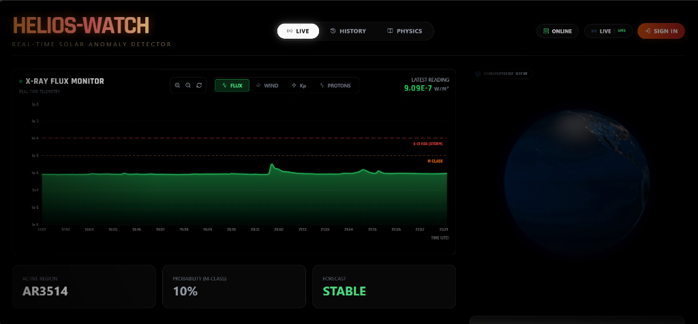
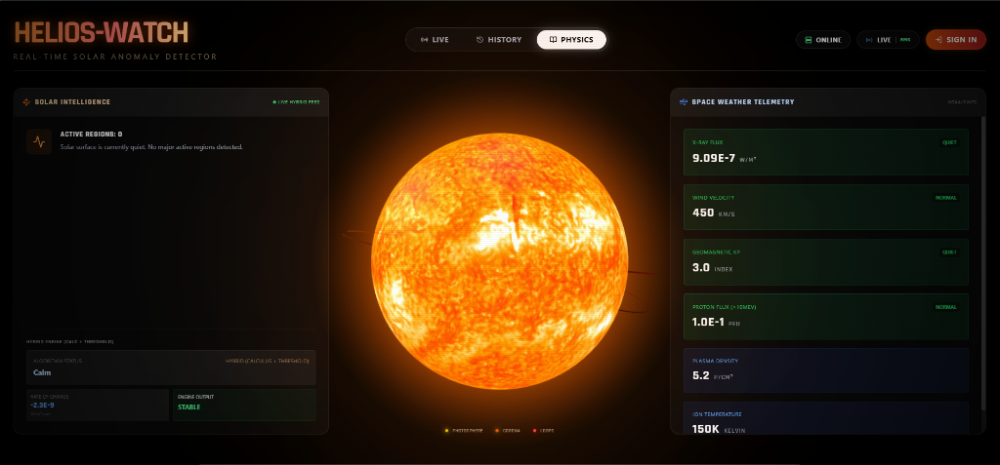
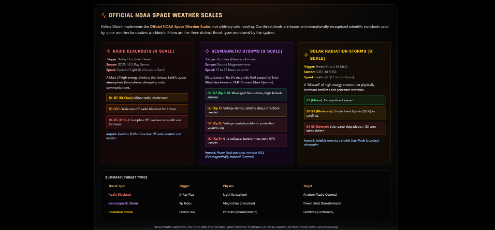

# Helios-Watch

**Real-time solar anomaly monitoring dashboard powered by NOAA satellite data.**  
Live X-ray flux, solar wind plasma, geomagnetic indices, and proton flux — streamed directly from GOES-16 and DSCOVR satellites to your browser via WebSockets.

> Built with FastAPI, React, Three.js, and Recharts. No polling on the client — the server pushes every 60 seconds.

---

## Live Dashboard



Real-time X-ray flux chart with logarithmic scale, NOAA flare classification thresholds (M-class and X-class dashed lines), quick metrics for active regions, M-class probability, and current forecast status. The ionosphere globe on the right visualizes Earth's magnetosphere state.

---

## Physics View



Three-column layout: **Solar Intelligence** panel (active region count, hybrid engine status, rate-of-change calculus), a high-resolution **3D Solar Globe** rendered with Three.js using an 8K sun texture, and **Space Weather Telemetry** cards showing live X-ray flux, wind velocity, Kp index, proton flux, plasma density, and ion temperature — each with color-coded severity badges pulled from NOAA standards.

---

## NOAA Space Weather Scales



Educational reference panel implementing the **Official NOAA Space Weather Scales**. Covers all three threat categories monitored by the system: Radio Blackouts (R-Scale, triggered by X-ray flux), Geomagnetic Storms (G-Scale, triggered by Kp index), and Solar Radiation Storms (S-Scale, triggered by proton flux). Includes a summary table mapping each threat type to its physics, trigger metric, and real-world target.

---

## Data Sources

All telemetry is fetched from official NOAA Space Weather Prediction Center (SWPC) APIs:

| Metric | Source | Endpoint |
|---|---|---|
| X-Ray Flux (0.1–0.8nm) | GOES-16 XRS | `swpc.noaa.gov/json/goes/primary/xrays-3-day.json` |
| Solar Wind Plasma | DSCOVR | `swpc.noaa.gov/products/solar-wind/plasma-5-minute.json` |
| Planetary Kp Index | Ground Magnetometers | `swpc.noaa.gov/products/noaa-planetary-k-index.json` |
| Proton Flux (≥10 MeV) | GOES-16 SEISS | `swpc.noaa.gov/json/goes/primary/integral-protons-1-day.json` |
| Active Sunspot Regions | SWPC | `swpc.noaa.gov/json/solar_regions.json` |

---

## Features

**Monitoring & Visualization**
- Real-time X-ray flux chart with logarithmic Y-axis and NOAA M/X-class threshold lines
- Interactive 3D Earth globe (ionosphere view) using `react-globe.gl`
- Interactive 3D Sun globe rendered with Three.js and 8K photosphere texture
- Six live telemetry cards with dynamic color-coded severity (Quiet → Storm → Critical)
- Solar wind velocity, plasma density, ion temperature, Kp index, and proton flux
- Active sunspot region tracking with magnetic complexity classification

**Anomaly Detection**
- Hybrid detection engine combining derivative-based calculus (dFlux/dt) with absolute NOAA thresholds
- Layer 1: M-class (≥1e-5 W/m²) and X-class (≥1e-4 W/m²) flare detection
- Layer 2: Early warning via rapid intensification detection before thresholds are breached
- Decay tracking for post-flare cooldown monitoring

**Alerting & Notifications**
- Full-screen browser alert overlay for X-class events
- Persistent anomaly logging to SQLite database with severity and timestamp
- Live alert timeline feed showing recent anomaly events
- SMTP email notification system dispatched via background threads
- Per-user alert threshold and notification preferences

**Historical Archive**
- Replay 5 major historical solar events: Carrington (1859), Quebec Blackout (1989), Bastille Day (2000), Halloween Storms (2003), G5 May Storm (2024)
- Animated X-ray flux, solar wind speed, and Kp index graphs with realistic flare rise/decay profiles

**Authentication & Preferences**
- Optional JWT authentication using HTTP-Only cookies (XSS-resistant)
- Per-user settings: email alert toggle, threshold level configuration
- Public-first dashboard — no login required to view live data

---

## Architecture

```
NOAA SWPC APIs ──── Async Scheduler (60s) ──── FastAPI Backend
                                                     │
                                            ┌────────┼────────┐
                                            │        │        │
                                       REST API  WebSocket  SQLite
                                       (Auth,    (Telemetry  (Users,
                                       Prefs,    Broadcast)  Alert Logs)
                                       Alerts)       │
                                            │        │
                                            └────────┼────────┘
                                                     │
                                              Vite/React SPA
                                          (Zustand, Three.js,
                                           Recharts, Globe.gl)
```

- **Backend heartbeat loop** runs as an `asyncio` task, polling NOAA every 60 seconds
- **WebSocket broadcast** pushes flux, telemetry, calculus, and active regions to all connected clients
- **Anomaly engine** runs on each heartbeat tick and triggers alerts + DB logging when thresholds are met
- **Email dispatch** runs in `asyncio.to_thread()` to avoid blocking the event loop

---

## Tech Stack

| Layer | Technology |
|---|---|
| Frontend | React 19, TypeScript, Vite 7 |
| Styling | Tailwind CSS, custom glassmorphism design system |
| State Management | Zustand |
| 3D Rendering | Three.js, react-globe.gl |
| Charts | Recharts (logarithmic, area, line) |
| Icons | Lucide React |
| Backend | FastAPI, Uvicorn (ASGI) |
| Real-Time | WebSockets (native FastAPI) |
| HTTP Client | httpx (async NOAA fetching) |
| Database | SQLAlchemy + SQLite |
| Auth | python-jose (JWT), passlib + bcrypt |
| Email | smtplib (Gmail App Password compatible) |

---

## Project Structure

```
backend/
  app/
    api/
      auth.py             # Login, register, preferences endpoints
      solar.py            # WebSocket, heartbeat, alert history, email dispatch
    core/
      config.py           # Environment variable loader (JWT, DB, CORS)
      security.py         # JWT encode/decode, password hashing
    models/
      db_models.py        # User, AlertEvent (SQLAlchemy ORM)
      schemas.py          # SolarPoint, telemetry Pydantic models
    services/
      anomaly_engine.py   # HybridEngine (derivative + threshold detection)
      noaa_service.py     # NOAA SWPC API fetchers (flux, wind, Kp, protons, regions)
      simulator_service.py # Storm simulation for testing
    main.py               # FastAPI app, CORS, router mounts, startup task
  requirements.txt
  Procfile                # Production start command

frontend/
  src/
    components/
      layout/Navbar.tsx   # Navigation bar, connection status, user settings
      views/
        PhysicsView.tsx   # 3D sun + telemetry + NOAA scales
        HistoryView.tsx   # Historical event replay
    features/
      alerts/
        AlertTimeline.tsx   # Live anomaly event feed
        FullScreenAlert.tsx # X-class event overlay
      auth/
        LoginModal.tsx      # Slide-in auth drawer
        authStore.ts        # Zustand auth state
      solar/
        SolarChart.tsx      # Recharts X-ray flux monitor
        SolarGlobe.tsx      # Three.js 3D sun
        EarthGlobe.tsx      # react-globe.gl Earth
        JudgeControlPanel.tsx # Simulation trigger panel
    hooks/
      useWebSocket.ts     # WebSocket connection manager with ping/pong latency
    services/
      api.ts              # Axios instance (VITE_API_BASE_URL)
      authService.ts      # Login/register/logout API calls
      solarService.ts     # Alert history fetcher
    store/
      useStore.ts         # Global Zustand store (flux, telemetry, alerts)
    utils/
      solarHelpers.ts     # Status color logic, telemetry formatting
    types/
      index.ts            # TypeScript interfaces
```

---

## Setup & Installation

### Backend

```bash
cd backend
python -m venv .venv
.venv\Scripts\activate        # Windows
# source .venv/bin/activate   # macOS/Linux
pip install -r requirements.txt
copy .env.example .env        # Configure JWT_SECRET
python -m uvicorn app.main:app --port 8001 --reload
```

Backend runs at `http://127.0.0.1:8001`. API docs at `http://127.0.0.1:8001/docs`.

### Frontend

```bash
cd frontend
npm install
npm run dev
```

Frontend runs at `http://localhost:5173`.

---

## Environment Variables

### Backend (`backend/.env`)

```env
JWT_SECRET=your-secret-key-here
JWT_ALGORITHM=HS256
JWT_EXPIRE_MINUTES=10080
DATABASE_URL=sqlite:///./helios.db
CORS_ORIGINS=http://localhost:5173
EMAIL_USER=your.email@gmail.com       # Optional
EMAIL_PASS=your-gmail-app-password    # Optional
```

### Frontend (`frontend/.env`)

```env
VITE_API_BASE_URL=http://127.0.0.1:8001
VITE_WS_URL=ws://127.0.0.1:8001/ws
```

---

## Simulation & Testing

To test the anomaly detection and alert pipeline without waiting for a real solar flare:

1. Open the **Live** tab on the dashboard
2. Log in with an account (optional — alerts work without login)
3. Use the **Judge Control Panel** to trigger a simulated X-class event
4. Observe: full-screen alert overlay, alert timeline update, and email dispatch (if configured)

---

## Deployment

The app is deployment-ready for platforms like Render (free tier):

- **Backend**: Python Web Service with `uvicorn app.main:app --host 0.0.0.0 --port $PORT`
- **Frontend**: Static Site with `npm run build` → publish `dist/`
- **SPA Routing**: `_redirects` file included for client-side routing support
- **CORS**: Configurable via `CORS_ORIGINS` environment variable

---

## License

MIT